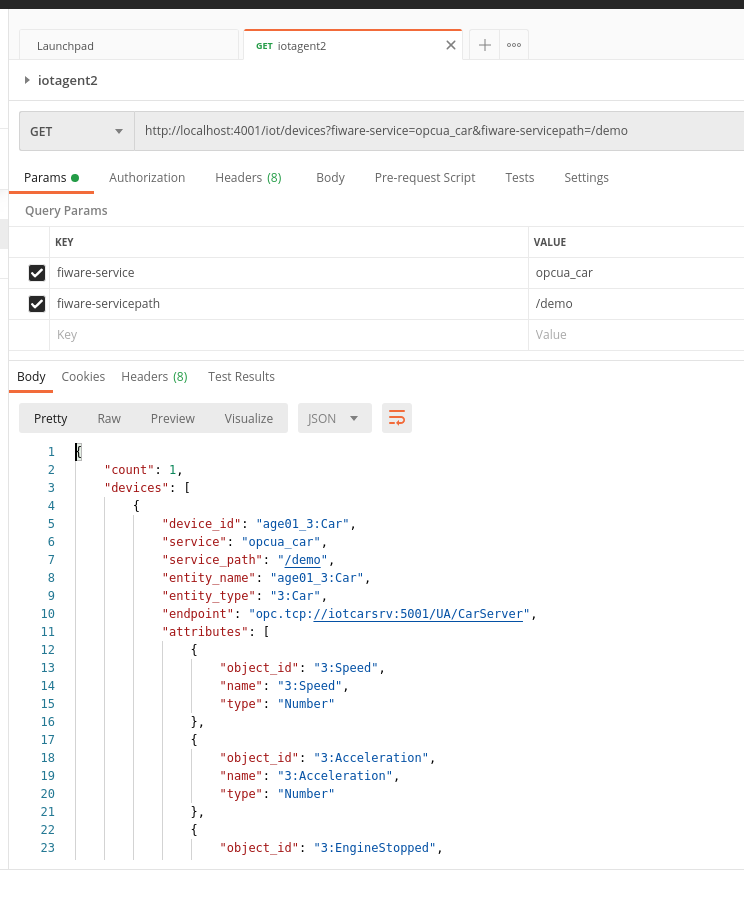
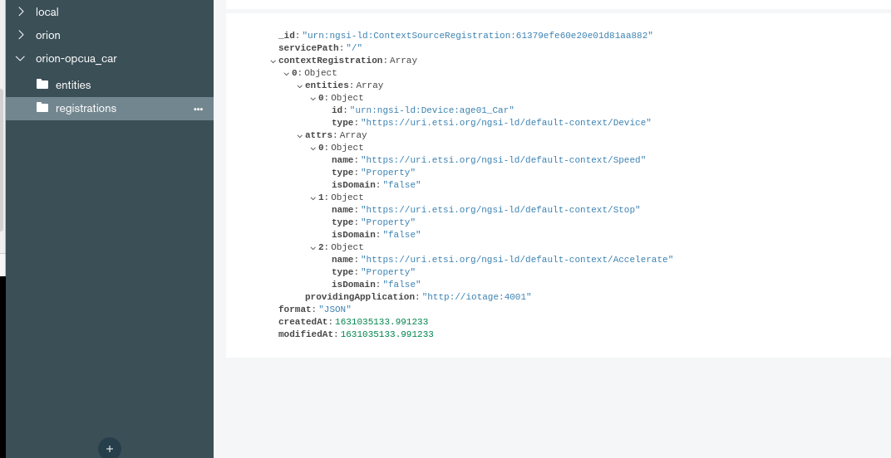
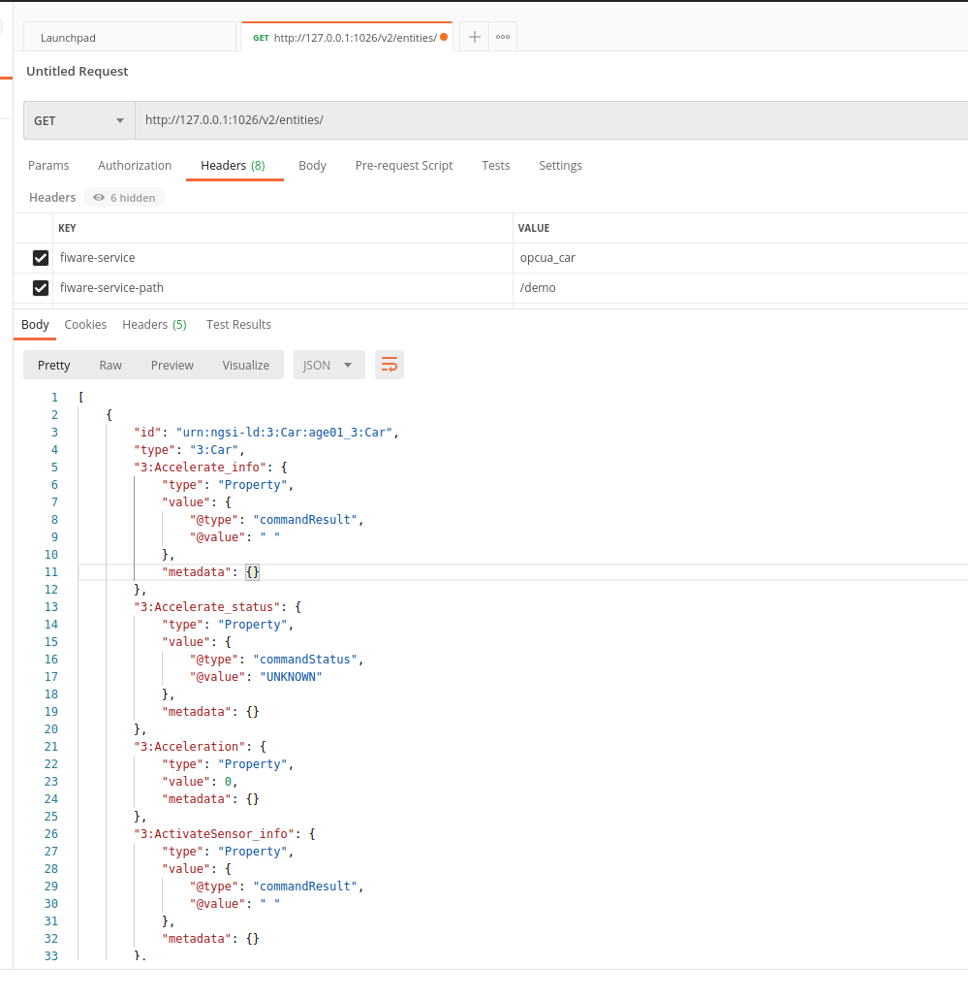
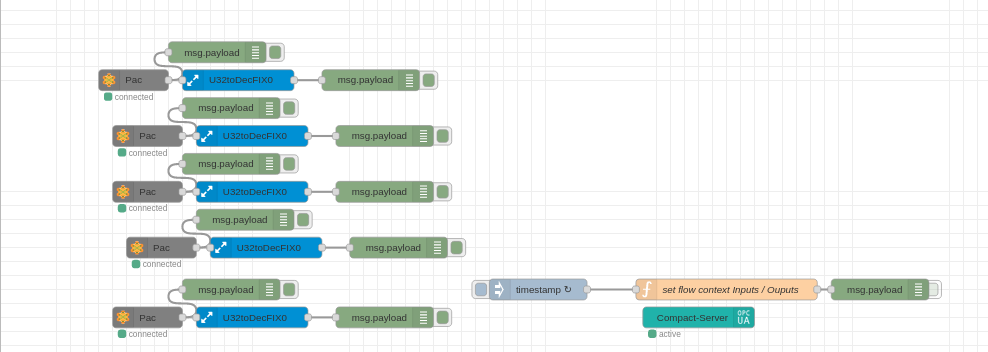
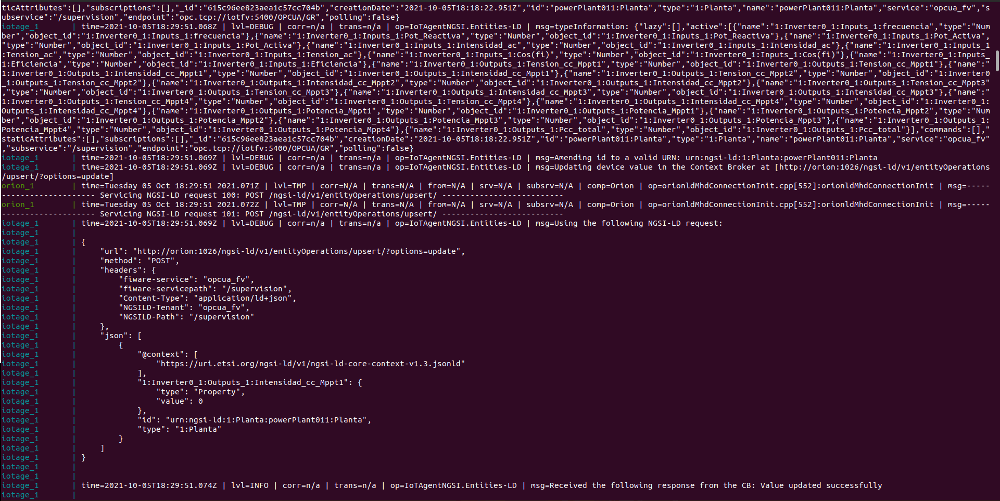

# OPC UA AGENT TUTORIAL 
-----

# Clonar repositorio OCUA en github
Se crea una ruta donde se clonará el repositorio:
```sh
$ mkdir -p /$HOME/docker/fiware/
```
```sh
$ git clone "https://github.com/Engineering-Research-and-Development/iotagent-opcua"
```

# Ejecutar el Testbed
Para lanzar el Testbed ejecutar el comando:
```sh
$ docker-compose up -d
```
>**Nota:** Para ver logs omitir -d en el comando anterior, o bien ejecutar
 ```sh
 $ docker-compose logs -f
 ```
### Error docker-compose up
Al realizar el comando `docker-compose up -d` se provocan varios errores
1. Error en OrionCB
```sh
orion_1        | INFO@2021-09-06T18:14:51.452Z  contextBroker.cpp[1012]: start command line </usr/bin/contextBroker -fg -multiservice -ngsiv1Autocast -disableFileLog -statCounters -dbhost orion_mongo -logForHumans -logLevel INFO -t 255>
orion_1        | incompatible options: traceLevels cannot be used without setting -logLevel to DEBUG
```
Se observa que en el archivo `docker-compose.yml` en la sección del `orion/commad`, aparecen los comandos -statCounters -dbhost orion_mongo -logForHumans -logLevel INFO -t 255.
```yaml
  orion:
    hostname: orion
    image: fiware/orion:latest
    networks:
      - hostnet
      - ocbnet
    ports:
      - "1026:1026"
    depends_on:
      - orion_mongo
    command: -statCounters -dbhost orion_mongo -logForHumans -logLevel INFO -t 255
```

2. Error en iotAgent-OPCUA
por lo que el contenedor del `iotagen` se detiene.
El error lanzado es:
```sh
iotage_1       | npm ERR! missing script: start
iotage_1       | 
iotage_1       | npm ERR! A complete log of this run can be found in:
iotage_1       | npm ERR!     /root/.npm/_logs/2021-09-06T18_14_53_269Z-debug.log
iotagent-opcua_iotage_1 exited with code 1
```
Se observa que en el archivo `docker-compose.yml` en la sección del `iotage/commad`, aparece el comando npm start.
```yaml
iotage:
    hostname: iotage
    image: iotagent4fiware/iotagent-opcua:latest
    networks:
      - hostnet
      - iotnet
    ports:
      - "4001:4001"
      - "4081:8080"
    depends_on:
      - iotcarsrv
      - iotmongo
      - orion
    volumes:
      - ./AGECONF:/opt/iotagent-opcua/conf
      - ./certificates:/opt/iotagent-opcua/certificates
    command: npm start
    environment:
      - IOTA_REGISTRY_TYPE=mongodb #Whether to hold IoT device info in memory or in a database
      - IOTA_LOG_LEVEL=DEBUG # The log level of the IoT Agent
      - IOTA_MONGO_HOST=iot_mongo # The host name of MongoDB
      - IOTA_MONGO_DB=iotagent_opcua # The name of the database used in mongoDB
      - IOTA_CB_NGSI_VERSION=ld # use NGSI-LD when sending updates for active attributes
      - IOTA_JSON_LD_CONTEXT=https://uri.etsi.org/ngsi-ld/v1/ngsi-ld-core-context-v1.3.jsonld
      - IOTA_FALLBACK_TENANT=opcua_car
      - IOTA_RELAX_TEMPLATE_VALIDATION=true
```

Comentando en la sección `orion/command` la parte final `-t 255`, se solucionan los errores.
```yaml
  orion:
    hostname: orion
    image: fiware/orion:latest
    networks:
      - hostnet
      - ocbnet
    ports:
      - "1026:1026"
    depends_on:
      - orion_mongo
    command: -statCounters -dbhost orion_mongo -logForHumans -logLevel INFO #-t 255
```

## Ver dispositivos conectados a iotAgent
Para comprobar los dispositivos vinculados al iotAgent desde la terminal, introducir:
```sh
curl http://localhost:4001/iot/devices -H "fiware-service: opcua_car" -H "fiware-servicepath: /demo"
```
Devolverá algo similar a:
```json
{"count":1,"devices":[{"device_id":"age01_Car","service":"opcua_car","service_path":"/demo","entity_name":"age01_Car","entity_type":"Device","endpoint":"opc.tcp://iotcarsrv:5001/UA/CarServer","attributes":[{"object_id":"Acceleration","name":"Acceleration","type":"Number"},{"object_id":"EngineStopped","name":"EngineStopped","type":"Boolean"},{"object_id":"Engine_Temperature","name":"Engine_Temperature","type":"Number"},{"object_id":"Engine_Oxigen","name":"Engine_Oxigen","type":"Number"},{"object_id":"DataBlocksGlobal_3_dbRfidCntr_3_ID1_3_xBusy","name":"DataBlocksGlobal_3_dbRfidCntr_3_ID1_3_xBusy","type":"String"},{"object_id":"DataBlocksGlobal_3_dbRfidCntr_3_ID1_3_xBusyStatus","name":"DataBlocksGlobal_3_dbRfidCntr_3_ID1_3_xBusyStatus","type":"Boolean"},{"object_id":"DataBlocksGlobal_3_dbRfidCntr_3_ID1_3_xDone","name":"DataBlocksGlobal_3_dbRfidCntr_3_ID1_3_xDone","type":"String"},{"object_id":"DataBlocksGlobal_3_dbRfidCntr_3_ID1_3_xDoneStatus","name":"DataBlocksGlobal_3_dbRfidCntr_3_ID1_3_xDoneStatus","type":"Boolean"}],"lazy":[],"commands":[{"object_id":"ns=3;s=Stop","name":"Stop","type":"command"},{"object_id":"ns=3;s=Accelerate","name":"Accelerate","type":"command"}],"static_attributes":[]}]}
```

También se puede comprobar desde **postman**, como se muestra en la siguiente imagen




Se puede comprobar los datos en la base de datos MongoDb en mongo, por ejemplo con MongoDB Compass.
Hay que conectarse a `localhost:27017`, como se puede observar, hay un documento creado para *age01_Car*



## Ver dispositivos conectados a OrionCB
Para comprobar los dispositivos vinculados al OrionCB desde la terminal, introducir:
```sh
curl -X GET http://localhost:1026/v2/entities/age01_Car/attrs/Speed -H 'fiware-service: opcua_car' -H 'fiware-service-path: /demo'
```

También se puede comprobar desde **postman**, como se muestra en la siguiente imagen


> **Nota:** Observar como en el método `GET` realizado al iotagent se pasa en el comando `-H 'fiware-servicepath: /demo'` y en este caso se pasa el comando con `-H 'fiware-service-path: /demo'`, esto parece ser por un error en el código fuente del ioagent, que se intentará resolver más adelante.


# Ejecutar Testbed con un servidor OPCUA externo
Primero detener los contenedores creados anteriormente, para ello ir al directorio donde se ubica el archivo `docker-compose.yml` y ejecutar:
```sh
$ docker-compose down -v
```
>**Nota**: Con `-v` se eliminarán también los volumenes creados.

Se ejecutara el archivo docker-compose-external-service.yml, que tendrá el siguiente contenido:
```yaml
version: "3"
#secrets:
#   age_idm_auth:
#      file: age_idm_auth.txt

services:
  iotage:
    hostname: iotage
    image: iotagent4fiware/iotagent-opcua:latest
    networks:
      - hostnet
      - iotnet
    ports:
      - "4001:4001"
      - "4081:8080"
    extra_hosts:
      - "iotcarsrv:192.168.40.42"
      - "pietro-deb.pietro.local:192.168.40.42"
    depends_on:
      - iotmongo
      - orion
    volumes:
      - ./AGECONF:/opt/iotagent-opcua/conf
    command: /usr/bin/tail -f /var/log/lastlog

  iotmongo:
    hostname: iotmongo
    image: mongo:4.2
    networks:
      - iotnet
    volumes:
      - iotmongo_data:/data/db
      - iotmongo_conf:/data/configdb

  ################ OCB ################

  orion:
    hostname: orion
    image: fiware/orion-ld:0.7.0 #replace with orion:latest if you mind using NGSIv2
    networks:
      - hostnet
      - ocbnet
    ports:
      - "1026:1026"
    depends_on:
      - orion_mongo
    #command: -dbhost mongo
    #entrypoint: /usr/bin/contextBroker -fg -multiservice -ngsiv1Autocast -statCounters -dbhost mongo -logForHumans -logLevel DEBUG #-t 255
    command: -statCounters -dbhost orion_mongo -logForHumans -logLevel DEBUG

  orion_mongo:
    hostname: orion_mongo
    image: mongo:4.2
    networks:
      ocbnet:
        aliases:
          - mongo
    volumes:
      - orion_mongo_data:/data/db
      - orion_mongo_conf:/data/configdb
    command: --nojournal

volumes:
  iotmongo_data:
  iotmongo_conf:
  orion_mongo_data:
  orion_mongo_conf:

networks:
  hostnet:
  iotnet:
  ocbnet:
```
Arrancar con docker-compose:
```sh
$ docker-compose -f docker-compose-external-server.yml up -d
```
Comprobar los log:
```sh
$ docker-compose logs -f
```
Observar como en este caso no aparace en ejecución el contenedor de *iotcarsrv*:
```sh
$ docker ps -a

CONTAINER ID   IMAGE                                   COMMAND                  CREATED         STATUS         PORTS                                                                                  NAMES
b658de8d891d   iotagent4fiware/iotagent-opcua:latest   "docker-entrypoint.s…"   2 minutes ago   Up 2 minutes   0.0.0.0:4001->4001/tcp, :::4001->4001/tcp, 0.0.0.0:4081->8080/tcp, :::4081->8080/tcp   iotagent-opcua_iotage_1
f2e24b318e21   fiware/orion-ld:0.7.0                   "orionld -fg -multis…"   2 minutes ago   Up 2 minutes   0.0.0.0:1026->1026/tcp, :::1026->1026/tcp                                              iotagent-opcua_orion_1
0b8251932707   mongo:4.2                               "docker-entrypoint.s…"   6 minutes ago   Up 6 minutes   27017/tcp                                                                              iotagent-opcua_orion_mongo_1
bddc1005c75f   mongo:4.2                               "docker-entrypoint.s…"   6 minutes ago   Up 6 minutes   27017/tcp                                                                              iotagent-opcua_iotmongo_1
```

Por último comprobar, tal y como se explica en apartados anteriores,desde la terminal con `curl` o desde **postman** los datos en el **iotagent**.

# Configuración para un servidor externo OPCUA
>**Nota:** En este caso no se utilizarán certificados de seguridad.

Primero detener los contenedores creados anteriormente, para ello ir al directorio donde se ubica el archivo `docker-compose.yml` y ejecutar:
```sh
$ docker-compose down -v
```
>**Nota**: Con `-v` se eliminarán también los volumenes creados.

### Configuración del archivo `AGECONF/config.properties` sera la siguiente:

```yaml
## SOUTHBOUND CONFIGURATION (OPC UA)
namespace-ignore=0,2,7
endpoint=opc.tcp://iotfv:5400/OPCUA/GR


## NORTHBOUND CONFIGURATION (ORION CONTEXT BROKER)
context-broker-host=orion
context-broker-port=1026
fiware-service=opcua_fv
fiware-service-path=/supervision

## AGENT CONFIGURATION
server-base-root=/
server-port=4001
provider-url=http://iotage:4001

device-registration-duration=P1M
device-registry-type=memory

log-level=DEBUG

namespaceIndex=1
namespaceNumericIdentifier=1000

# MONGO-DB CONFIGURATION (required if device-registry-type=mongodb)
mongodb-host=iotmongo
mongodb-port=27017
mongodb-db=iotagent
mongodb-retries=5
mongodb-retry-time=5

## DATATYPE MAPPING OPCUA --> NGSI
OPC-datatype-Number=Number
OPC-datatype-Decimal128=Number
OPC-datatype-Double=Number
OPC-datatype-Float=Number
OPC-datatype-Integer=Integer
OPC-datatype-UInteger=Integer
OPC-datatype-String=Text
OPC-datatype-ByteString=Text
#END DATATYPE MAPPING OPCUA --> NGSI

## SESSION PARAMETERS
requestedPublishingInterval=10
requestedLifetimeCount=1000
requestedMaxKeepAliveCount=10
maxNotificationsPerPublish=100
publishingEnabled=true
priority=10

#SubscriptionsStrategy
uniqueSubscription=true

## MONITORING PARAMETERS
samplingInterval=1
queueSize=10000
discardOldest=false

## SERVER CERT E AUTH
securityMode=None
securityPolicy=None
userName=
password=

#securityMode=SIGNANDENCRYPT
#securityPolicy=1Basic256
#password=password1
#userName=user1

#api-ip=192.168.13.153

## ADMINISTRATION SERVICES
api-port=8080

## POLL COMMANDS SETTINGS
polling=false
polling-commands-timer=30000
pollingDaemonFrequency=20000
pollingExpiration=200000

## AGENT ID
agent-id=powerPlant01
entity-id=opcuaFvPlant

## CONFIGURATION
# configuration=api Se comenta para que cree el json automáticamente con mapping tool

## CHECK TIMER POLLING DEVICES
checkTimer=2000
```

### Configuración archivo docker-compose.yml, que tendrá el siguiente contenido:

```yaml
version: "3"

services:
  iotage:
    hostname: iotage
    image: iotagent4fiware/iotagent-opcua:latest
    networks:
      - hostnet
      - iotnet
    ports:
      - "4001:4001"
      - "4081:8080"
    extra_hosts:
      - "iotfv:10.0.0.1"
      - "iotfvServer:10.0.0.1"
    depends_on:
      - iotmongo
      - orion
    volumes:
      #- ./AGECONF:/opt/iotagent-opcua/conf
      - ./AGECONF:/usr/src/app/conf # config volume for latest version of iotagent4fiware/iotagent-opcua
      #- ./certificates:/opt/iotagent-opcua/certificates
      - ./certificates:/usr/src/app/certificates # certificates volume for latest version of iotagent4fiware/iotagent-opcua
    environment:
      - IOTA_REGISTRY_TYPE=mongodb #Whether to hold IoT device info in memory or in a database
      - IOTA_LOG_LEVEL=DEBUG # The log level of the IoT Agent
      - IOTA_MONGO_HOST=iot_mongo # The host name of MongoDB
      - IOTA_MONGO_DB=iotagent_opcua # The name of the database used in mongoDB
      - IOTA_CB_NGSI_VERSION=ld #comment if you mind using NGSIv2
      - IOTA_JSON_LD_CONTEXT=https://uri.etsi.org/ngsi-ld/v1/ngsi-ld-core-context-v1.3.jsonld #comment if you mind using NGSIv2
      - IOTA_FALLBACK_TENANT=opcua_car
      - IOTA_RELAX_TEMPLATE_VALIDATION=true

  iotmongo:
    hostname: iot_mongo
    image: mongo:4.2
    networks:
      - iotnet
    volumes:
      - iot_mongo_data:/data/db
      - iot_mongo_conf:/data/configdb

  ################ OCB ################

  orion:
    hostname: orion
    image: fiware/orion-ld:latest #replace with orion:latest if you mind using NGSIv2
    networks:
      - hostnet
      - ocbnet
    ports:
      - "1026:1026"
    depends_on:
      - orion_mongo
    command: -statCounters -dbhost orion_mongo -logLevel INFO -forwarding

  orion_mongo:
    hostname: orion_mongo
    image: mongo:4.2
    networks:
      - ocbnet
    ports:
      - "27017:27017"
    volumes:
      - orion_mongo_data:/data/db
      - orion_mongo_conf:/data/configdb
    command: --nojournal

volumes:
  iot_mongo_data:
  iot_mongo_conf:
  orion_mongo_data:
  orion_mongo_conf:

networks:
  hostnet:
  iotnet:
  ocbnet:
```
### Configuración **node-red** servidor **OPCUA**

```typescript
function constructAlarmAddressSpace(server, addressSpace, eventObjects, done) {
  // server = the created node-opcua server
  // addressSpace = address space of the node-opcua server
  // eventObjects = add event variables here to hold them in memory from this script

  // internal sandbox objects are:
  // node = the compact server node,
  // coreServer = core compact server object for debug and access to NodeOPCUA
  // this.sandboxNodeContext = node context node-red
  // this.sandboxFlowContext = flow context node-red
  // this.sandboxGlobalContext = global context node-red
  // this.sandboxEnv = env variables
  // timeout and interval functions as expected from nodejs

  const opcua = coreServer.choreCompact.opcua;
  const LocalizedText = opcua.LocalizedText;
  const namespace = addressSpace.getOwnNamespace();

  const Variant = opcua.Variant;
  const DataType = opcua.DataType;
  const DataValue = opcua.DataValue;

  var flexServerInternals = this;

  this.sandboxFlowContext.set("f_opc", 0);
  this.sandboxFlowContext.set("Qac_opc", 0);
  this.sandboxFlowContext.set("Pac_opc", 0);
  this.sandboxFlowContext.set("IRac_opc", 0);
  this.sandboxFlowContext.set("VRac_opc", 0);
  this.sandboxFlowContext.set("Cos(fi)_opc", 0);
  this.sandboxFlowContext.set("Eficiencia_opc", 0);

  this.sandboxFlowContext.set("Vcc1_opc", 0);
  this.sandboxFlowContext.set("Icc1_opc", 0);
  this.sandboxFlowContext.set("Vcc2_opc", 0);
  this.sandboxFlowContext.set("Icc2_opc", 0);
  this.sandboxFlowContext.set("Vcc3_opc", 0);
  this.sandboxFlowContext.set("Icc3_opc", 0);
  this.sandboxFlowContext.set("Vcc4_opc", 0);
  this.sandboxFlowContext.set("Icc4_opc", 0);
  this.sandboxFlowContext.set("Pcc1_opc", 0);
  this.sandboxFlowContext.set("Pcc2_opc", 0);
  this.sandboxFlowContext.set("Pcc3_opc", 0);
  this.sandboxFlowContext.set("Pcc4_opc", 0);
  this.sandboxFlowContext.set("Pcc_opc", 0);
  

  coreServer.debugLog("init dynamic address space");
  const rootFolder = addressSpace.findNode("RootFolder");

  node.warn("construct new address space for OPC UA");

  const fvPlant = namespace.addFolder(rootFolder.objects, {
    "browseName": "Planta"
  });
  const inveter0 = namespace.addFolder(fvPlant, { "browseName": "Inverter0" });
  const Inputs = namespace.addFolder(inveter0, {
    "browseName": "Inputs"
  });
  const Outputs = namespace.addFolder(inveter0, {
    "browseName": "Outputs"
  });
 // const isoInternal = namespace.addFolder(inveter0, {
 //   "browseName": "Internal"
 // });

  const I1 = namespace.addVariable({
    "organizedBy": Inputs,
    "browseName": "frecuencia",
    "nodeId": "ns=1;s=f",
    "dataType": "Double",
    "value": {
      "get": function() {
        return new Variant({
          "dataType": DataType.Double,
          "value": flexServerInternals.sandboxFlowContext.get("f_opc")
        });
      },
      "set": function(variant) {
        flexServerInternals.sandboxFlowContext.set(
          "f_opc",
          parseFloat(variant.value)
        );
        return opcua.StatusCodes.Good;
      }
    }
  });

  const I2 = namespace.addVariable({
    "organizedBy": Inputs,
    "browseName": "Pot_Reactiva",
    "nodeId": "ns=1;s=Qac",
    "dataType": "Double",
    "value": {
      "get": function() {
        return new Variant({
          "dataType": DataType.Double,
          "value": flexServerInternals.sandboxFlowContext.get("Qac_opc")
        });
      },
      "set": function(variant) {
        flexServerInternals.sandboxFlowContext.set(
          "Qac_opc",
          parseFloat(variant.value)
        );
        return opcua.StatusCodes.Good;
      }
    }
  });

  const I3 = namespace.addVariable({
    "organizedBy": Inputs,
    "browseName": "Pot_Activa",
    "nodeId": "ns=1;s=Pac",
    "dataType": "Double",
    "value": {
      "get": function() {
        return new Variant({
          "dataType": DataType.Double,
          "value": flexServerInternals.sandboxFlowContext.get("Pac_opc")
        });
      },
      "set": function(variant) {
        flexServerInternals.sandboxFlowContext.set(
          "Pac_opc",
          parseFloat(variant.value)
        );
        return opcua.StatusCodes.Good;
      }
    }
  });

  const I4 = namespace.addVariable({
    "organizedBy": Inputs,
    "browseName": "Intensidad_ac",
    "nodeId": "ns=1;s=IRac",
    "dataType": "Double",
    "value": {
      "get": function() {
        return new Variant({
          "dataType": DataType.Double,
          "value": flexServerInternals.sandboxFlowContext.get("IRac_opc")
        });
      },
      "set": function(variant) {
        flexServerInternals.sandboxFlowContext.set(
          "IRac_opc",
          parseFloat(variant.value)
        );
        return opcua.StatusCodes.Good;
      }
    }
  });

  const I5 = namespace.addVariable({
    "organizedBy": Inputs,
    "browseName": "Tension_ac",
    "nodeId": "ns=1;s=VRac",
    "dataType": "Double",
    "value": {
      "get": function() {
        return new Variant({
          "dataType": DataType.Double,
          "value": flexServerInternals.sandboxFlowContext.get("VRac_opc")
        });
      },
      "set": function(variant) {
        flexServerInternals.sandboxFlowContext.set(
          "VRac_opc",
          parseFloat(variant.value)
        );
        return opcua.StatusCodes.Good;
      }
    }
  });

  const I6 = namespace.addVariable({
    "organizedBy": Inputs,
    "browseName": "Cos(fi)",
    "nodeId": "ns=1;s=Cos(fi)",
    "dataType": "Double",
    "value": {
      "get": function() {
        return new Variant({
          "dataType": DataType.Double,
          "value": flexServerInternals.sandboxFlowContext.get("Cos(fi)_opc")
        });
      },
      "set": function(variant) {
        flexServerInternals.sandboxFlowContext.set(
          "Cos(fi)_opc",
          parseFloat(variant.value)
        );
        return opcua.StatusCodes.Good;
      }
    }
  });

  const I7 = namespace.addVariable({
    "organizedBy": Inputs,
    "browseName": "Eficiencia",
    "nodeId": "ns=1;s=Eficiencia",
    "dataType": "Double",
    "value": {
      "get": function() {
        return new Variant({
          "dataType": DataType.Double,
          "value": flexServerInternals.sandboxFlowContext.get("Eficiencia_opc")
        });
      },
      "set": function(variant) {
        flexServerInternals.sandboxFlowContext.set(
          "Eficiencia_opc",
          parseFloat(variant.value)
        );
        return opcua.StatusCodes.Good;
      }
    }
  });


  const O1 = namespace.addVariable({
    "organizedBy": Outputs,
    "browseName": "Tension_cc_Mppt1",
    "nodeId": "ns=1;s=Vcc1",
    "dataType": "Double",
    "value": {
      "get": function() {
        return new Variant({
          "dataType": DataType.Double,
          "value": flexServerInternals.sandboxFlowContext.get("Vcc1_opc")
        });
      },
      "set": function(variant) {
        flexServerInternals.sandboxFlowContext.set(
          "Vcc1_opc",
          parseFloat(variant.value)
        );
        return opcua.StatusCodes.Good;
      }
    }
  });

  const O2 = namespace.addVariable({
    "organizedBy": Outputs,
    "browseName": "Intensidad_cc_Mppt1",
    "nodeId": "ns=1;s=Icc1",
    "dataType": "Double",
    "value": {
      "get": function() {
        return new Variant({
          "dataType": DataType.Double,
          "value": flexServerInternals.sandboxFlowContext.get("Icc1_opc")
        });
      },
      "set": function(variant) {
        flexServerInternals.sandboxFlowContext.set(
          "Icc1_opc",
          parseFloat(variant.value)
        );
        return opcua.StatusCodes.Good;
      }
    }
  });

  const O3 = namespace.addVariable({
    "organizedBy": Outputs,
    "browseName": "Tension_cc_Mppt2",
    "nodeId": "ns=1;s=Vcc2",
    "dataType": "Double",
    "value": {
      "get": function() {
        return new Variant({
          "dataType": DataType.Double,
          "value": flexServerInternals.sandboxFlowContext.get("Vcc2_opc")
        });
      },
      "set": function(variant) {
        flexServerInternals.sandboxFlowContext.set(
          "Vcc2_opc",
          parseFloat(variant.value)
        );
        return opcua.StatusCodes.Good;
      }
    }
  });

  const O4 = namespace.addVariable({
    "organizedBy": Outputs,
    "browseName": "Intensidad_cc_Mppt2",
    "nodeId": "ns=1;s=Icc2",
    "dataType": "Double",
    "value": {
      "get": function() {
        return new Variant({
          "dataType": DataType.Double,
          "value": flexServerInternals.sandboxFlowContext.get("Icc2_opc")
        });
      },
      "set": function(variant) {
        flexServerInternals.sandboxFlowContext.set(
          "Icc2_opc",
          parseFloat(variant.value)
        );
        return opcua.StatusCodes.Good;
      }
    }
  });
    

  const O5 = namespace.addVariable({
    "organizedBy": Outputs,
    "browseName": "Tension_cc_Mppt3",
    "nodeId": "ns=1;s=Vcc3",
    "dataType": "Double",
    "value": {
      "get": function() {
        return new Variant({
          "dataType": DataType.Double,
          "value": flexServerInternals.sandboxFlowContext.get("Vcc3_opc")
        });
      },
      "set": function(variant) {
        flexServerInternals.sandboxFlowContext.set(
          "Vcc3_opc",
          parseFloat(variant.value)
        );
        return opcua.StatusCodes.Good;
      }
    }
  });

  const O6 = namespace.addVariable({
    "organizedBy": Outputs,
    "browseName": "Intensidad_cc_Mppt3",
    "nodeId": "ns=1;s=Icc3",
    "dataType": "Double",
    "value": {
      "get": function() {
        return new Variant({
          "dataType": DataType.Double,
          "value": flexServerInternals.sandboxFlowContext.get("Icc3_opc")
        });
      },
      "set": function(variant) {
        flexServerInternals.sandboxFlowContext.set(
          "Icc3_opc",
          parseFloat(variant.value)
        );
        return opcua.StatusCodes.Good;
      }
    }
  });

  const O7 = namespace.addVariable({
    "organizedBy": Outputs,
    "browseName": "Tension_cc_Mppt4",
    "nodeId": "ns=1;s=Vcc4",
    "dataType": "Double",
    "value": {
      "get": function() {
        return new Variant({
          "dataType": DataType.Double,
          "value": flexServerInternals.sandboxFlowContext.get("Vcc4_opc")
        });
      },
      "set": function(variant) {
        flexServerInternals.sandboxFlowContext.set(
          "Vcc4_opc",
          parseFloat(variant.value)
        );
        return opcua.StatusCodes.Good;
      }
    }
  });

  const O8 = namespace.addVariable({
    "organizedBy": Outputs,
    "browseName": "Intensidad_cc_Mppt4",
    "nodeId": "ns=1;s=Icc4",
    "dataType": "Double",
    "value": {
      "get": function() {
        return new Variant({
          "dataType": DataType.Double,
          "value": flexServerInternals.sandboxFlowContext.get("Icc4_opc")
        });
      },
      "set": function(variant) {
        flexServerInternals.sandboxFlowContext.set(
          "Icc4_opc",
          parseFloat(variant.value)
        );
        return opcua.StatusCodes.Good;
      }
    }
  });
  
   const O9 = namespace.addVariable({
    "organizedBy": Outputs,
    "browseName": "Potencia_Mppt1",
    "nodeId": "ns=1;s=Pcc1",
    "dataType": "Double",
    "value": {
      "get": function() {
        return new Variant({
          "dataType": DataType.Double,
          "value": flexServerInternals.sandboxFlowContext.get("Pcc1_opc")
        });
      },
      "set": function(variant) {
        flexServerInternals.sandboxFlowContext.set(
          "Pcc1_opc",
          parseFloat(variant.value)
        );
        return opcua.StatusCodes.Good;
      }
    }
  });
  
  const O10 = namespace.addVariable({
    "organizedBy": Outputs,
    "browseName": "Potencia_Mppt2",
    "nodeId": "ns=1;s=Pcc2",
    "dataType": "Double",
    "value": {
      "get": function() {
        return new Variant({
          "dataType": DataType.Double,
          "value": flexServerInternals.sandboxFlowContext.get("Pcc2_opc")
        });
      },
      "set": function(variant) {
        flexServerInternals.sandboxFlowContext.set(
          "Pcc2_opc",
          parseFloat(variant.value)
        );
        return opcua.StatusCodes.Good;
      }
    }
  });
  
  const O11 = namespace.addVariable({
    "organizedBy": Outputs,
    "browseName": "Potencia_Mppt3",
    "nodeId": "ns=1;s=Pcc3",
    "dataType": "Double",
    "value": {
      "get": function() {
        return new Variant({
          "dataType": DataType.Double,
          "value": flexServerInternals.sandboxFlowContext.get("Pcc3_opc")
        });
      },
      "set": function(variant) {
        flexServerInternals.sandboxFlowContext.set(
          "Pcc3_opc",
          parseFloat(variant.value)
        );
        return opcua.StatusCodes.Good;
      }
    }
  });
  
  const O12 = namespace.addVariable({
    "organizedBy": Outputs,
    "browseName": "Potencia_Mppt4",
    "nodeId": "ns=1;s=Pcc4",
    "dataType": "Double",
    "value": {
      "get": function() {
        return new Variant({
          "dataType": DataType.Double,
          "value": flexServerInternals.sandboxFlowContext.get("Pcc4_opc")
        });
      },
      "set": function(variant) {
        flexServerInternals.sandboxFlowContext.set(
          "Pcc4_opc",
          parseFloat(variant.value)
        );
        return opcua.StatusCodes.Good;
      }
    }
  });
  
  const O13 = namespace.addVariable({
    "organizedBy": Outputs,
    "browseName": "Pcc_total",
    "nodeId": "ns=1;s=PccTotal",
    "dataType": "Double",
    "value": {
      "get": function() {
        return new Variant({
          "dataType": DataType.Double,
          "value": flexServerInternals.sandboxFlowContext.get("Pcc_opc")
        });
      },
      "set": function(variant) {
        flexServerInternals.sandboxFlowContext.set(
          "Pcc_opc",
          parseFloat(variant.value)
        );
        return opcua.StatusCodes.Good;
      }
    }
  });
  
  
  

  //------------------------------------------------------------------------------
  // Add a view
  //------------------------------------------------------------------------------
  const viewDI = namespace.addView({
    "organizedBy": rootFolder.views,
    "browseName": "Inverter_Inputs"
  });

  const viewDO = namespace.addView({
    "organizedBy": rootFolder.views,
    "browseName": "Inverter_Outputs"
  });

  viewDI.addReference({
    "referenceType": "Organizes",
    "nodeId": I1.nodeId
  });

  viewDI.addReference({
    "referenceType": "Organizes",
    "nodeId": I2.nodeId
  });

  viewDI.addReference({
    "referenceType": "Organizes",
    "nodeId": I3.nodeId
  });

  viewDI.addReference({
    "referenceType": "Organizes",
    "nodeId": I4.nodeId
  });

  viewDI.addReference({
    "referenceType": "Organizes",
    "nodeId": I5.nodeId
  });

  viewDI.addReference({
    "referenceType": "Organizes",
    "nodeId": I6.nodeId
  });

  viewDI.addReference({
    "referenceType": "Organizes",
    "nodeId": I7.nodeId
  });

  

  viewDO.addReference({
    "referenceType": "Organizes",
    "nodeId": O1.nodeId
  });

  viewDO.addReference({
    "referenceType": "Organizes",
    "nodeId": O2.nodeId
  });

  viewDO.addReference({
    "referenceType": "Organizes",
    "nodeId": O3.nodeId
  });

  viewDO.addReference({
    "referenceType": "Organizes",
    "nodeId": O4.nodeId
  });

  viewDO.addReference({
    "referenceType": "Organizes",
    "nodeId": O5.nodeId
  });

  viewDO.addReference({
    "referenceType": "Organizes",
    "nodeId": O6.nodeId
  });

  viewDO.addReference({
    "referenceType": "Organizes",
    "nodeId": O7.nodeId
  });

  viewDO.addReference({
    "referenceType": "Organizes",
    "nodeId": O8.nodeId
  });
  
  viewDO.addReference({
    "referenceType": "Organizes",
    "nodeId": O9.nodeId
  });
  
  viewDO.addReference({
    "referenceType": "Organizes",
    "nodeId": O10.nodeId
  });
  
  viewDO.addReference({
    "referenceType": "Organizes",
    "nodeId": O11.nodeId
  });
  
  viewDO.addReference({
    "referenceType": "Organizes",
    "nodeId": O12.nodeId
  });
  
  viewDO.addReference({
    "referenceType": "Organizes",
    "nodeId": O13.nodeId
  });
  coreServer.debugLog("create dynamic address space done");
  node.warn("construction of new address space for OPC UA done");

  done();
}
```



> **Nota:** Se puede obtener el archivo **.json** del flujo completo de node-red [aquí](../nodeRed_OPCUA_SERVER/flows_Huawei-Inverter_OPCUA.json)

Arrancar con docker-compose:

```sh
$ docker-compose up -d
```
Comprobar los log:
```sh
$ docker-compose logs -f
```
>**Nota:** Observar como en este caso no encuentra creado al inicio el archivo `AGECONF/config.json`, por lo que la aplicación **mapping_tool.jar** se ejutará al inicio para crearlo.




Por último comprobar, tal y como se explica en apartados anteriores,desde la terminal con `curl` o desde **postman** los datos en el **iotagent**.


----

# Problemas detectados en el iotagent 

## Problemas en la ruta de los volumenes creados

Se ha detectado que para que lac onfiguración introducida en el directorio `AGECONF`  y `certificates`se haga efectiva, ha de cambiarse la ruta del volumen creado según la versión de iotagent que se use:

* **iotagent4fiware/iotagent-opcua:latest**
  * `./AGECONF:/usr/src/app/conf`
  * `./certificates:/usr/src/app/certificates`
* **iotagent4fiware/iotagent-opcua:1.3.4**
  * `./AGECONF:/opt/iotagent-opcua/conf`
  * `./certificates:/opt/iotagent-opcua/certificates`

Observando el fichero en el repositorio `iotagent-opcua/docker/Dockerfile` se puede observar como aparace la linea `WORKDIR /opt/iotagent-opcua` para crear la imagen. Posiblemente para la versión `latest ` esto haya cambiado a `WORKDIR /usr/src/app`

**Por tanto, según la versión de iotagent4fiware/iotagent-opcua que se use, se deberá cambiar las rutas de los volumenes.**

## ~~Problemas con ficheros internos~~

~~Como se pudo observar, en el método `GET` realizado al **iotagent**, se pasa el comando `-H 'fiware-servicepath: /demo'` y en el caso de atacar al **OrionCB** se le pasa el metodo `GET` con el comando `-H 'fiware-service-path: /demo'`, esto puede deberse a un error en el código fuente del **iotagent**, donde se haya definido `fiware-servicepath` en lugar de `fiware-service-path`~~

### ~~Sustituir fiware-servicepath por fiware-service-path*******~~

> Esta parte está bajo estudio, aún no se ha conseguido ningún resultado.

~~Para ello hay que modificar en todos los lugares donde aparece definido `fiware-servicepath` por `fiware-service-path` hay que modificar varios ficheros dentro del contenedor del **iotagent**.~~

~~`/usr/src/app/iot-agent-modules/run/mongogroup.js`~~

~~`/usr/src/app/tests/add-test.js`~~

~~`/usr/src/app/tests/test.js`~~


